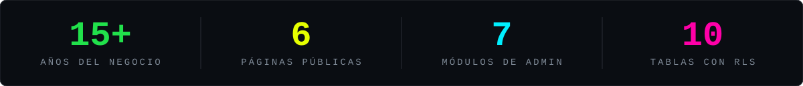
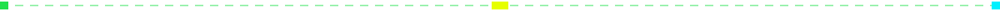
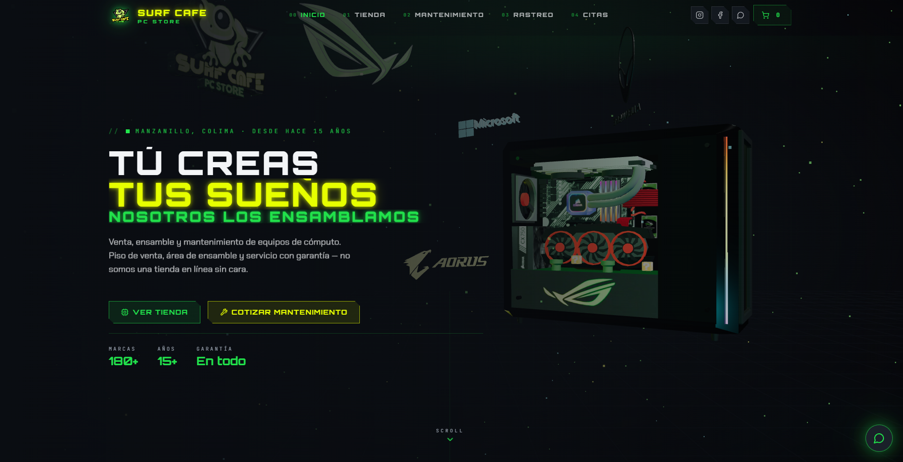
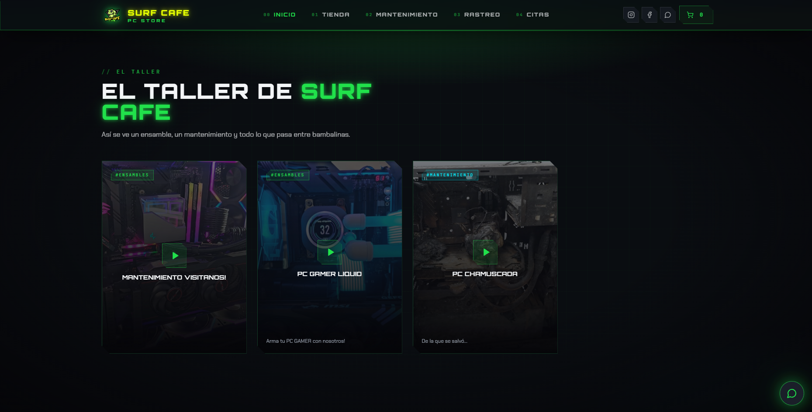
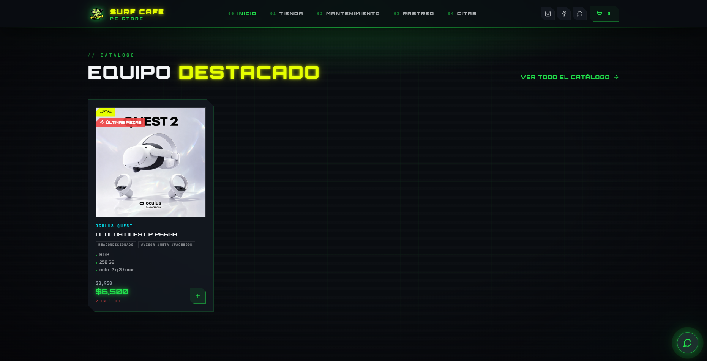
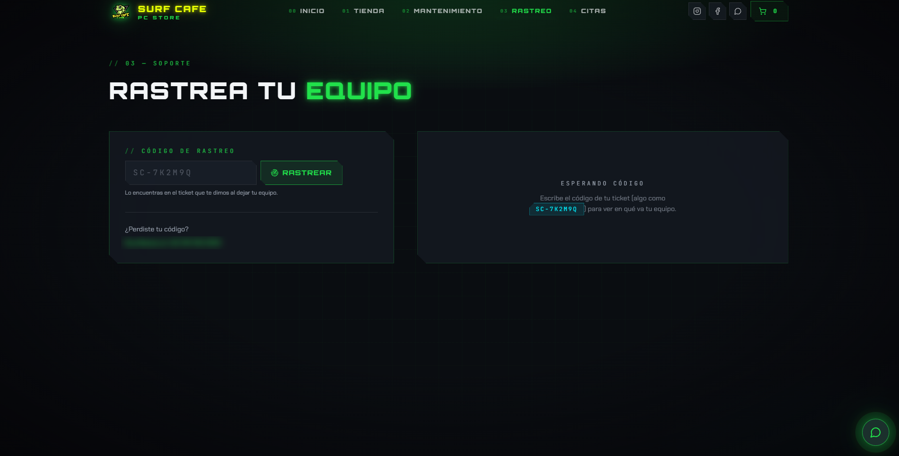
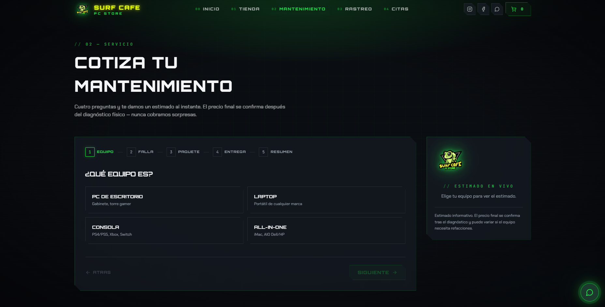
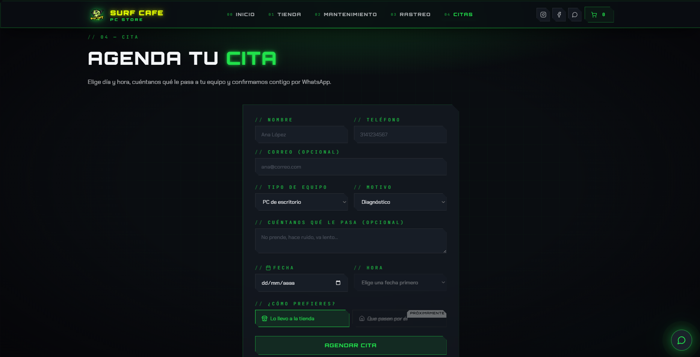

<div align="center">



<br>

[](https://darkred-curlew-858904.hostingersite.com)


<br>


<br>

<a href="#sobre"></a>
<a href="#modulos"></a>
<a href="#specs"></a>
<a href="#arquitectura"></a>
<a href="#creditos"></a>

<br><br>



</div>



<a name="sobre"></a>

## `[01]` // SOBRE EL PROYECTO

```bash
$ cat /etc/surfcafe/about.txt

CLIENTE   : Surf Cafe PC Store · Manzanillo, Colima
GIRO      : venta, ensamble y mantenimiento de equipos de cómputo
TRAYECTORIA: más de 15 años con piso de venta, área de ensamble y garantía
ESTE REPO : rediseño completo del sitio + panel de administración
```

**Surf Cafe PC Store** es una tienda de tecnología y taller de reparación con cara y local, no una tienda en línea anónima. El sitio anterior no reflejaba eso, así que lo rediseñé desde cero con una identidad **hacker / retro-gaming**: fondo oscuro tipo terminal, verde neón de la rana de la marca, HUD con acentos cian y magenta, un PC gamer en 3D en la portada y un recorrido de scroll que cuenta el proceso de mantenimiento paso a paso.

Lo más importante no se ve a primera vista: el negocio ya puede **dar de alta productos, mover reparaciones y publicar videos del taller** desde un panel propio, sin tocar código. Y sus clientes pueden **consultar en qué paso va su equipo** con el código del ticket, sin llamar ni escribir por WhatsApp.


<a name="modulos"></a>

## `[02]` // MÓDULOS

```bash
$ ls -l /var/www/surfcafe/modulos
```

| Módulo | Ruta | Qué hace |
|---|---|---|
| **Portada** | `/` | PC gamer 3D con ajuste automático al tamaño real del modelo, proceso de 5 pasos con scroll (diagnóstico, limpieza, pasta térmica, overclock, RGB), galería del taller, equipos destacados y reseñas. |
| **Tienda** | `/tienda` · `/tienda/producto` | Catálogo en vivo desde Supabase, con categorías, precios y descuentos. Un producto nuevo aparece al instante, sin recompilar el sitio. |
| **Cotizador** | `/mantenimiento` | Asistente por pasos: tipo de equipo, paquete y falla. Calcula un estimado desde el primer paso con precios editables desde el panel. |
| **Rastreo** | `/rastreo` | El cliente escribe el código de su ticket y ve el estado de su reparación y la nota del técnico. |
| **Citas** | `/citas` | Agenda de citas con horarios disponibles. |
| **Panel admin** | `/admin/*` | Productos (alta, edición y fotos), tablero Kanban de reparaciones, videos de "El Taller", precios del cotizador, citas e inventario. |


<a name="specs"></a>

## `[03]` // SPECS DEL SISTEMA

```bash
$ neofetch --stack
```

| Componente | Detalle |
|---|---|
| **Framework** | Next.js 14 (App Router) con exportación estática, React 18, TypeScript |
| **Estilos** | Tailwind CSS, tokens propios (verde neón `#21E14B`, amarillo `#E6FF00`, cian `#00F0FF`, magenta `#FF00A8`, fondo `#0A0D12`) |
| **Animación** | GSAP (scroll narrativo) y Framer Motion (interfaz) |
| **3D** | Three.js con React Three Fiber y Drei |
| **Datos y sesión** | Supabase: Postgres, Auth y Storage |
| **Formularios y estado** | React Hook Form, Zod y Zustand |
| **Interfaz** | Radix UI, Sonner, lucide-react, dnd-kit (arrastrar tarjetas del Kanban) |
| **Hosting** | Hostinger (`public_html`), sin servidor propio |


<a name="arquitectura"></a>

## `[04]` // ARQUITECTURA

```text
  ┌──────────────┐   npm run build    ┌───────────────────┐
  │  Next.js 14  │ ─────────────────▶ │  /out  (estático) │ ──▶  Hostinger / public_html
  └──────┬───────┘                    └─────────┬─────────┘
         │                                      │
         │        fetch desde el navegador      │
         ▼                                      ▼
  ┌──────────────────────────────────────────────────────┐
  │  Supabase  ·  Postgres + Auth + Storage              │
  │  10 tablas  ·  RLS: is_staff() protege el panel      │
  └──────────────────────────────────────────────────────┘
```

Como el sitio es **100% estático**, todo lo dinámico (tienda, rastreo, cotizador, panel) se pide a Supabase desde el navegador. Por eso un cambio en el panel se ve en el sitio al momento.

Tablas principales: `products`, `repairs`, `orders`, `appointments`, `profiles`, `workshop_videos` y las del cotizador (`service_devices`, `service_tiers`, `service_issues`, `service_settings`). El esquema completo está en [`supabase/migrations`](supabase/migrations).


<a name="capturas"></a>

## `[04b]` // CAPTURAS

<p align="center">
  
  
</p>
<p align="center">
  
  
</p>
<p align="center">
  
  
</p>


<a name="creditos"></a>

## `[05]` // CRÉDITOS Y LICENCIA

- Diseño, desarrollo y panel de administración: **Carlo Ramirez** ([@ZaekoRam](https://github.com/ZaekoRam)).
- Modelos 3D de [Sketchfab](https://sketchfab.com), todos con licencia CC-BY-4.0:
  - **Pc Gamer (Animation)**, de Caio de Oliveira ([@caio17011](https://sketchfab.com/caio17011)).
  - **LOGO ASUS RoG 3D**, de lelex · **AORUS LOGO**, de caryhero4330 · **Microsoft Logo 2012-Present**, de Shape 3D Inc.
  - Detalle y enlaces a cada modelo en [`CREDITS.md`](CREDITS.md).
- La marca, el logotipo y las fotografías pertenecen a **Surf Cafe PC Store**.

Este código se muestra como parte de mi portafolio. No incluye licencia de reutilización: todos los derechos reservados.

<div align="center">

<sub><code>$ exit</code> &nbsp;·&nbsp; logout — gracias por pasar por el taller.</sub>

[](https://darkred-curlew-858904.hostingersite.com)

</div>
